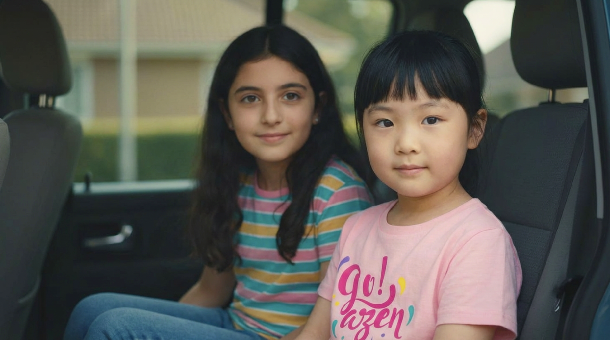

# Cinematic Multi-Angle System v0.5

Nano Banana Pro — gemini-2.0-flash-preview-image-generation

ArtefactoFilms | 30/11/2025

---

Sistema de prompts para generar **63 ángulos cinematográficos** de cualquier imagen, organizados en 7 grids de 3×3.

Mantiene coherencia total: misma ropa, misma pose, mismo entorno, misma luz. Solo cambia el ángulo de cámara.

**Regla de oro:** No se inventa nada. No se añade nada. Todo coherente con la imagen original.



---

## Los 7 Sets

| Set | Nombre | Qué cubre |
|:---:|--------|-----------|
| 1 | Classic Cinematic | Planos frontales clásicos (ELS a ECU + picado/contrapicado) |
| 2 | Three-Quarter 45° | Rotaciones laterales y diagonales |
| 3 | Drone / Reverse / Low | Aéreos, reversos 180°, planos desde suelo |
| 4 | Full Rear 180° | Todos los planos vistos desde la espalda |
| 5 | Dutch Angles | Horizonte inclinado (15°, 30°, 45°) |
| 6 | Focal Length | Mismo ángulo, diferentes lentes (wide, normal, tele) |
| 7 | Lighting Variations | Mismo ángulo, diferente iluminación |

---

## Glosario de planos

| Código | Nombre | Qué es |
|--------|--------|--------|
| **ELS** | Extreme Long Shot | Plano general extremo. Sujeto pequeño en el entorno. Establece ubicación. |
| **LS** | Long Shot | Plano general. Sujeto de cuerpo entero (pies a cabeza). |
| **MLS** | Medium Long Shot | Plano americano. Corta por las rodillas. Clásico de westerns. |
| **MS** | Medium Shot | Plano medio. Corta por la cintura. Ideal para diálogos. |
| **MCU** | Medium Close-Up | Plano medio corto. Corta por el pecho. Más íntimo. |
| **CU** | Close-Up | Primer plano. Solo el rostro o frente del objeto. |
| **ECU** | Extreme Close-Up | Primerísimo plano. Detalle extremo: ojos, manos, texturas. |
| **Low Angle** | Contrapicado | Cámara baja mirando arriba. Sensación de poder/heroísmo. |
| **High Angle** | Picado | Cámara alta mirando abajo. Sensación de vulnerabilidad. |
| **Nadir** | Nadir | Cámara en suelo apuntando 90° arriba. Bajo el sujeto. |
| **Zenith** | Cenital | Cámara encima apuntando 90° abajo. Vista de pájaro. |
| **Dutch Angle** | Plano holandés | Horizonte inclinado. Sensación de tensión, desorientación. |

---

---

## SET 1 — Classic Cinematic

Planos clásicos de cine desde el eje frontal.


#### Estructura del grid

| | Col 1 | Col 2 | Col 3 |
|:--|:------|:------|:------|
| **Fila 1** | ELS — General extremo | LS — General | MLS — Americano |
| **Fila 2** | MS — Medio | MCU — Medio corto | CU — Primer plano |
| **Fila 3** | ECU — Primerísimo | Low — Contrapicado | High — Picado |

#### Prompt

```md
<instruction>
Analyze the entire composition of the input image. Identify ALL key subjects present (whether it's a single person, a group/couple, a vehicle, or a specific object) and their spatial relationship/interaction.

Generate a cohesive 3x3 grid "Cinematic Contact Sheet" featuring 9 distinct camera shots of exactly these subjects in the same environment.

STRICT RULES:
- DO NOT invent or add ANY new elements, objects, people, or details not present in the original image.
- DO NOT change poses, clothing, props, background, or lighting.
- ONLY the camera position and framing changes between panels.
- Maintain ABSOLUTE consistency across all 9 panels.

You must adapt the standard cinematic shot types to fit the content (e.g., if a group, keep the group together; if an object, frame the whole object):

ROW 1 — ESTABLISHING CONTEXT:
1. (ELS) Extreme Long Shot: The subject(s) seen small within the vast environment. Camera far away.
2. (LS) Long Shot: The subject(s) visible from top to bottom (head to toe for people / full frame for objects).
3. (MLS) Medium Long Shot (American 3/4): Framed from knees up (for people) or a 3/4 view (for objects).

ROW 2 — CORE COVERAGE:
4. (MS) Medium Shot: Framed from waist up (or central core of object). Focus on interaction/action.
5. (MCU) Medium Close-Up: Framed from chest up. Intimate framing of the main subject(s).
6. (CU) Close-Up: Tight framing on the face(s) or the "front" of the object.

ROW 3 — DETAILS & ANGLES:
7. (ECU) Extreme Close-Up: Macro detail focusing intensely on a key feature (eyes, hands, logo, texture).
8. (Low Angle) Worm's Eye: Looking UP at the subject(s) from ground level. Imposing/heroic perspective.
9. (High Angle) Bird's Eye: Looking DOWN on the subject(s) from above.

The depth of field must shift realistically: deep focus in wide shots, shallow bokeh in close-ups.
</instruction>

OUTPUT: A professional 3x3 cinematic storyboard grid containing 9 panels. Photorealistic textures, consistent cinematic color grading, and correct framing. NO invented elements.
```

---

---

## SET 2 — Three-Quarter 45°

Variaciones con rotación lateral de cámara a 45°.


#### Estructura del grid

| | Col 1 | Col 2 | Col 3 |
|:--|:------|:------|:------|
| **Fila 1** | ELS +10° elevación | LS 45° lateral | MLS 45° + tilt up |
| **Fila 2** | MS frontal (ref.) | MCU 45° retrato 3/4 | CU -10° desde arriba |
| **Fila 3** | ECU macro | Low 45° diagonal | High 45° diagonal |

#### Prompt

```tex
<instruction>
Analyze the entire composition of the input image. Identify ALL key subjects present (whether it's a single person, a group/couple, a vehicle, or a specific object) and their spatial relationship/interaction.

Generate a cohesive 3x3 grid "Advanced Cinematic Contact Sheet" featuring 9 distinct camera shots with 45° ROTATIONS and TILTS applied to each standard shot type.

STRICT RULES:
- DO NOT invent or add ANY new elements, objects, people, or details not present in the original image.
- DO NOT change poses, clothing, props, background, or lighting.
- The subjects remain in the EXACT same position — ONLY the camera rotates around them.
- Maintain ABSOLUTE consistency across all 9 panels.

ROW 1 — ESTABLISHING WITH DIRECTIONAL VARIATION:
1. (ELS +10°) Extreme Long Shot with slight elevation (+10° vertical tilt). Subject(s) small in environment, camera slightly above eye level.
2. (LS 45°) Long Shot with 45° horizontal rotation. Full body visible but camera positioned at three-quarter angle to the subject.
3. (MLS 45° Low-Tilt) Medium Long Shot (knees up) with 45° rotation AND +15° upward tilt. Camera looking slightly up at subject from the side.

ROW 2 — CORE COVERAGE WITH ROTATION:
4. (MS) Medium Shot: Straight-on waist-up framing. Reference anchor shot with no rotation.
5. (MCU 45°) Medium Close-Up with 45° rotation. Chest-up framing showing the classic "three-quarter portrait" angle.
6. (CU -10°) Close-Up with slight downward angle (-10° from above). Face/front visible with subtle high perspective.

ROW 3 — DYNAMIC DIAGONAL ANGLES:
7. (ECU) Extreme Close-Up: Macro detail of key feature (eyes, hands, logo, texture). Same as Set 1 for continuity.
8. (Low Angle 45°) Strong diagonal low angle. Camera on ground, looking UP at 45° angle to the subject. Dramatic upward diagonal.
9. (High Angle 45°) Diagonal bird's eye. Camera above, looking DOWN at 45° diagonal angle. Not directly overhead.

The depth of field must shift realistically. Maintain consistent cinematic lighting throughout.
</instruction>

OUTPUT: A professional 3x3 cinematic storyboard grid containing 9 panels with three-quarter and diagonal camera positions. Photorealistic textures, consistent color grading. NO invented elements. Same subjects, same scene, ONLY camera angle changes.
```

---

---

## SET 3 — Drone / Reverse / Low

Ángulos extremos: aéreos, reversos, y desde el suelo.


#### Estructura del grid

| | Col 1 | Col 2 | Col 3 |
|:--|:------|:------|:------|
| **Fila 1 — Drone** | Cenital 90° | Drone 60° | Drone 45° |
| **Fila 2 — Reverse** | Reverse MLS | Reverse MS | Reverse CU |
| **Fila 3 — Suelo** | Low 30° | Low 60° | Nadir 90° |

#### Prompt

```tex
<instruction>
Analyze the entire composition of the input image. Identify ALL key subjects present (whether it's a single person, a group/couple, a vehicle, or a specific object) and their spatial relationship/interaction.

Generate a cohesive 3x3 grid "Extreme Angles Contact Sheet" featuring 9 distinct camera shots with AERIAL, REVERSE, and GROUND-LEVEL perspectives.

STRICT RULES:
- DO NOT invent or add ANY new elements, objects, people, or details not present in the original image.
- DO NOT change poses, clothing, props, background, or lighting.
- NO new objects. NO scene alterations. ONLY camera height and angle changes.
- The subjects remain in the EXACT same position — the camera moves to extreme positions around them.
- Maintain ABSOLUTE consistency across all 9 panels.

ROW 1 — DRONE/AERIAL TOP-DOWN ANGLES:
1. (Drone 90°) Perfect perpendicular top-down shot. Camera directly above subject(s), looking straight down at 90°. Full overhead view.
2. (Drone 60°) Elevated drone angle at approximately 60° downward. Camera high but angled, showing top and partial front of subject(s).
3. (Drone 45°) Lower drone position at approximately 45° downward. More of the subject's front visible while still elevated.

ROW 2 — 180° REVERSE ANGLES (Camera moves to opposite side):
4. (Reverse MLS 180°) Medium Long Shot but with camera repositioned 180° from Set 1. If Set 1 showed the front, this shows what the subject FACES (the environment in front of them), with subject(s) visible from behind or profile.
5. (Reverse MS 180°) Medium Shot from the reverse position. Waist-up framing but from the opposite camera position as Set 1.
6. (Reverse CU 180°) Close-Up from the reverse angle. If Set 1 CU showed the face, this shows the back of head/profile, or what's in front of the subject.

ROW 3 — LOW ANGLES (Ground-Up Progression):
7. (Low 30°) Camera at ground level, tilted 30° upward toward subject(s). Slight heroic angle.
8. (Low 60°) Camera at ground level, tilted 60° upward. Strong heroic/imposing perspective.
9. (Nadir 90°) Perfect nadir shot. Camera on ground pointing straight UP at 90°. Directly beneath the subject looking up (if subject is standing) or extreme low angle.

Depth of field and lighting must remain consistent with the original image.
</instruction>

OUTPUT: A professional 3x3 cinematic storyboard grid containing 9 panels with extreme vertical and reverse camera positions. Photorealistic textures, consistent color grading. NO invented elements. Same subjects, same scene, ONLY camera position changes.
```

---

---

## SET 4 — Full Rear 180°

La cámara rota completamente para ver a los sujetos **de espaldas**. Los sujetos no se dan vuelta.


#### Estructura del grid

| | Col 1 | Col 2 | Col 3 |
|:--|:------|:------|:------|
| **Fila 1 — Wide** | Rear ELS | Rear LS | Rear MLS |
| **Fila 2 — Medium** | Rear MS | Rear MCU | Rear CU |
| **Fila 3 — Detail** | Rear ECU | Rear Low 45° | Rear High 45° |

**Nota:** El Set 3 Reverse muestra lo que está FRENTE a los sujetos. El Set 4 muestra las ESPALDAS — rotación física completa alrededor de ellos.

#### Prompt

```tex
<instruction>
Analyze the entire composition of the input image. Identify ALL key subjects present (whether it's a single person, a group/couple, a vehicle, or a specific object) and their spatial relationship/interaction.

Generate a cohesive 3x3 grid "Rear View Contact Sheet" featuring 9 distinct camera shots showing the subjects FROM BEHIND.

CRITICAL CONCEPT:
- The camera physically rotates 180° AROUND the subject(s) to show their BACK.
- The subjects DO NOT turn around. They maintain their original pose.
- You are showing what their back/rear looks like from the same focal lengths as Set 1.

STRICT RULES:
- DO NOT invent or add ANY new elements, objects, people, or details not present in the original image.
- DO NOT change poses, clothing, props, or lighting.
- The subjects remain in the EXACT same position and pose — ONLY the camera moves behind them.
- Maintain ABSOLUTE consistency across all 9 panels.
- Extrapolate the back view logically based on the visible clothing, hair, and body position in the original image.

ROW 1 — WIDE BACK VIEWS:
1. (Rear ELS) Extreme Long Shot from behind. Subject(s) seen small within the environment, but viewed from the back. Camera far behind them.
2. (Rear LS) Long Shot from behind. Full body visible (head to toe / full object) but showing the back side.
3. (Rear MLS) Medium Long Shot from behind. Knees up (or 3/4 of object) showing the back.

ROW 2 — MEDIUM BACK SHOTS:
4. (Rear MS) Medium Shot from behind. Waist up, showing back of torso, shoulders, and back of head.
5. (Rear MCU) Medium Close-Up from behind. Chest up from behind — back of head, shoulders, upper back, neck visible.
6. (Rear CU) Close-Up from behind. Tight framing on back of head, showing hair detail, ears, nape of neck, collar.

ROW 3 — BACK DETAILS & ANGLES:
7. (Rear ECU) Extreme Close-Up of back details. Macro focus on hair texture, fabric of clothing on back, neckline, earrings from behind, etc.
8. (Rear Low 45°) Low angle from behind. Camera low and behind the subject(s), looking UP at their back at approximately 45°. Heroic rear view.
9. (Rear High 45°) High angle from behind. Camera elevated and behind the subject(s), looking DOWN at their back at approximately 45°.

Depth of field must shift realistically. Lighting should be consistent with how the original light source would illuminate the back of the subjects.
</instruction>

OUTPUT: A professional 3x3 cinematic storyboard grid containing 9 panels showing the subjects from behind. Photorealistic textures, consistent color grading. NO invented elements. Same subjects, same pose, same clothing — ONLY viewed from the rear.
```

---

---

## SET 5 — Dutch Angles

Planos con horizonte inclinado. Crean tensión, desorientación, dinamismo o inestabilidad psicológica.


#### Estructura del grid

| | Col 1 | Col 2 | Col 3 |
|:--|:------|:------|:------|
| **Fila 1 — 15°** | LS Dutch 15° izq | MS Dutch 15° der | CU Dutch 15° izq |
| **Fila 2 — 30°** | LS Dutch 30° der | MS Dutch 30° izq | CU Dutch 30° der |
| **Fila 3 — 45°** | LS Dutch 45° izq | MS Dutch 45° der | CU Dutch 45° izq |

#### Prompt

```ini
<instruction>
Analyze the entire composition of the input image. Identify ALL key subjects present (whether it's a single person, a group/couple, a vehicle, or a specific object) and their spatial relationship/interaction.

Generate a cohesive 3x3 grid "Dutch Angle Contact Sheet" featuring 9 distinct camera shots with TILTED HORIZON (Dutch angles) at varying degrees.

STRICT RULES:
- DO NOT invent or add ANY new elements, objects, people, or details not present in the original image.
- DO NOT change poses, clothing, props, background, or lighting.
- The subjects remain in the EXACT same position — ONLY the camera rotates on its roll axis (tilting the horizon).
- Maintain ABSOLUTE consistency across all 9 panels.
- The horizon line must be visibly tilted in each shot.

ROW 1 — SUBTLE DUTCH (15° tilt):
1. (LS Dutch 15° Left) Long Shot with horizon tilted 15° counter-clockwise. Full body visible, slight unease.
2. (MS Dutch 15° Right) Medium Shot with horizon tilted 15° clockwise. Waist-up, subtle tension.
3. (CU Dutch 15° Left) Close-Up with horizon tilted 15° counter-clockwise. Face framing with mild disorientation.

ROW 2 — MODERATE DUTCH (30° tilt):
4. (LS Dutch 30° Right) Long Shot with horizon tilted 30° clockwise. Full body, clear diagonal tension.
5. (MS Dutch 30° Left) Medium Shot with horizon tilted 30° counter-clockwise. Waist-up, noticeable instability.
6. (CU Dutch 30° Right) Close-Up with horizon tilted 30° clockwise. Strong psychological tension.

ROW 3 — EXTREME DUTCH (45° tilt):
7. (LS Dutch 45° Left) Long Shot with horizon tilted 45° counter-clockwise. Full body, maximum dramatic angle.
8. (MS Dutch 45° Right) Medium Shot with horizon tilted 45° clockwise. Waist-up, extreme disorientation.
9. (CU Dutch 45° Left) Close-Up with horizon tilted 45° counter-clockwise. Intense, unsettling framing.

Depth of field and lighting must remain consistent with the original image. The tilt is ONLY on the camera's roll axis — not pan or pitch.
</instruction>

OUTPUT: A professional 3x3 cinematic storyboard grid containing 9 panels with Dutch angle (canted) framing at 15°, 30°, and 45° tilts. Photorealistic textures, consistent color grading. NO invented elements. Same subjects, same scene, ONLY horizon tilt changes.
```

---

---

## SET 6 — Focal Length Variations

Mismo ángulo frontal (MS), diferentes distancias focales. Muestra cómo cambia la perspectiva y compresión.


#### Estructura del grid

| | Col 1 | Col 2 | Col 3 |
|:--|:------|:------|:------|
| **Fila 1 — Wide** | 16mm ultra wide | 24mm wide | 35mm moderate wide |
| **Fila 2 — Normal** | 50mm normal | 85mm portrait | 105mm short tele |
| **Fila 3 — Telephoto** | 135mm medium tele | 200mm telephoto | 300mm super tele |

#### Prompt

```tex
<instruction>
Analyze the entire composition of the input image. Identify ALL key subjects present (whether it's a single person, a group/couple, a vehicle, or a specific object) and their spatial relationship/interaction.

Generate a cohesive 3x3 grid "Focal Length Contact Sheet" featuring 9 shots of the SAME FRAMING (Medium Shot, waist-up) but captured with DIFFERENT FOCAL LENGTHS, showing how lens choice affects perspective distortion and background compression.

STRICT RULES:
- DO NOT invent or add ANY new elements, objects, people, or details not present in the original image.
- DO NOT change poses, clothing, props, or lighting.
- The subjects remain in the EXACT same position and the framing (waist-up MS) stays consistent.
- ONLY the focal length changes — affecting perspective distortion and background compression.
- Maintain ABSOLUTE consistency across all 9 panels.

ROW 1 — WIDE ANGLE LENSES (expanded perspective, more background, barrel distortion):
1. (16mm Ultra Wide) Extreme wide angle. Strong barrel distortion near edges, exaggerated perspective, vast background visible, subject appears to have enlarged features closest to camera.
2. (24mm Wide) Wide angle. Moderate distortion, expanded sense of space, more environmental context visible behind subject.
3. (35mm Moderate Wide) Slight wide angle. Minimal distortion, natural but spacious feel, good balance of subject and environment.

ROW 2 — NORMAL TO PORTRAIT LENSES (natural perspective):
4. (50mm Normal) Standard lens. No distortion, perspective matches human eye, natural proportions, moderate background visibility.
5. (85mm Portrait) Classic portrait lens. Slight background compression, flattering facial proportions, subject separated from background.
6. (105mm Short Telephoto) Short tele. Noticeable background compression, shallow depth of field effect, subject isolated.

ROW 3 — TELEPHOTO LENSES (compressed perspective, isolated subject):
7. (135mm Medium Telephoto) Background significantly compressed, subject flattened, strong isolation from environment.
8. (200mm Telephoto) Strong compression, background appears much closer, very shallow depth of field, subject dominant.
9. (300mm Super Telephoto) Extreme compression, background almost flattened against subject, maximum isolation, surveillance/paparazzi aesthetic.

All shots maintain the same subject size in frame (MS framing) — the camera distance changes to compensate for focal length while keeping consistent framing.
</instruction>

OUTPUT: A professional 3x3 cinematic storyboard grid containing 9 panels showing the same Medium Shot framing captured with focal lengths from 16mm to 300mm. Photorealistic textures, consistent color grading. NO invented elements. Same subjects, same pose — ONLY focal length and resulting perspective changes.
```

---

---

## SET 7 — Lighting Variations

Mismo plano (MS frontal), diferentes esquemas de iluminación.


#### Estructura del grid

| | Col 1 | Col 2 | Col 3 |
|:--|:------|:------|:------|
| **Fila 1 — Classic** | Paramount (butterfly) | Rembrandt | Split lighting |
| **Fila 2 — Dramatic** | Rim/backlight | Under lighting | Top lighting |
| **Fila 3 — Mood** | High key | Low key | Silhouette |

#### Prompt

```tex
<instruction>
Analyze the entire composition of the input image. Identify ALL key subjects present (whether it's a single person, a group/couple, a vehicle, or a specific object) and their spatial relationship/interaction.

Generate a cohesive 3x3 grid "Lighting Variations Contact Sheet" featuring 9 shots with the SAME FRAMING (Medium Shot, frontal) but with DIFFERENT LIGHTING SETUPS, showing how light direction and quality affects mood and dimension.

STRICT RULES:
- DO NOT invent or add ANY new elements, objects, people, or details not present in the original image.
- DO NOT change poses, clothing, props, or camera angle.
- The subjects remain in the EXACT same position and framing.
- ONLY the lighting setup changes — direction, quality, and contrast.
- Maintain ABSOLUTE consistency of subject across all 9 panels.
- Extrapolate how the existing clothing, skin, and materials would respond to each lighting setup.

ROW 1 — CLASSIC PORTRAIT LIGHTING:
1. (Paramount/Butterfly) Key light directly above and in front of camera. Creates butterfly-shaped shadow under nose. Glamorous, classic Hollywood. Even, flattering illumination.
2. (Rembrandt) Key light 45° to one side and slightly above. Creates triangle of light on shadow-side cheek. Dramatic but natural, painterly quality.
3. (Split Lighting) Key light at 90° to one side. Exactly half the face lit, half in shadow. Strong, dramatic, mysterious.

ROW 2 — DRAMATIC LIGHTING:
4. (Rim/Backlight) Primary light from behind subject. Creates glowing edge/halo around subject, face in relative shadow. Ethereal, separation from background.
5. (Under Lighting) Light source from below face. Unnatural, horror-film aesthetic. Creates unsettling shadows, inverted facial features.
6. (Top Lighting) Harsh light from directly above. Deep eye socket shadows, strong nose shadow, theatrical/interrogation feel.

ROW 3 — MOOD/EXPOSURE LIGHTING:
7. (High Key) Bright, even lighting with minimal shadows. Light, airy, optimistic mood. Low contrast, soft shadows, bright background.
8. (Low Key) Dark overall with selective highlights. Noir aesthetic, moody, mysterious. High contrast, deep shadows, dark background.
9. (Silhouette) Subject backlit with no fill. Subject appears as dark shape against bright background. Maximum drama, identity obscured, graphic quality.

Color temperature should remain consistent (unless silhouette). The subject's materials (skin, fabric, hair) should realistically respond to each lighting direction.
</instruction>

OUTPUT: A professional 3x3 cinematic storyboard grid containing 9 panels showing the same Medium Shot with 9 different lighting setups. Photorealistic textures, accurate light behavior on materials. NO invented elements. Same subjects, same pose, same framing — ONLY lighting changes.
```

---

---

## Mapa de cobertura

```ini
                        ARRIBA
                      Drone 90°
                          │
               Drone 60°  │  Drone 45°
                     ╲    │    ╱
                      ╲   │   ╱
        High 45° ──────╲  │  ╱────── High Angle
                        ╲ │ ╱
                         ╲│╱
      ATRÁS ◄─────────────●─────────────► FRENTE
     (Set 4)             ╱│╲             (Set 1)
                        ╱ │ ╲
                       ╱  │  ╲
        Low 45° ──────╱   │   ╲────── Low Angle
                     ╱    │    ╲
               45° Izq    │    45° Der
                 (Set 2)  │  (Set 2)
                          │
                     Low Angles
                    30° / 60° / 90°
                        ABAJO

    + Dutch Angles (Set 5): Roll axis 15°/30°/45°
    + Focal Length (Set 6): 16mm — 300mm
    + Lighting (Set 7): 9 esquemas de luz
```

---

## Resumen

| Set | Variable | Variaciones |
|:----|:---------|:------------|
| Set 1 | Posición frontal | 9 planos clásicos |
| Set 2 | Rotación 45° | 9 planos diagonales |
| Set 3 | Altura extrema | 9 planos drone/suelo/reverso |
| Set 4 | Posición trasera | 9 planos de espalda |
| Set 5 | Inclinación horizonte | 9 dutch angles (15°/30°/45°) |
| Set 6 | Distancia focal | 9 lentes (16mm—300mm) |
| Set 7 | Iluminación | 9 esquemas de luz |
| **Total** | | **63 variaciones** |

---

## Cómo usar

1. Sube tu imagen al modelo de IA (Gemini 2.0 Flash)
2. Copia el prompt completo del set (incluyendo `<instruction>`)
3. Genera el grid 3×3
4. Repite con los otros sets

**Orden recomendado:** Set 1 → Set 2 → Set 3 → Set 4 → Set 5 → Set 6 → Set 7

---

## Checklist de coherencia

| Verificar | OK | Error |
|:----------|:---|:------|
| Identidad | Mismos rostros/objetos | Caras cambiadas |
| Vestuario | Misma ropa exacta | Colores diferentes |
| Pose | Misma posición | Pose alterada |
| Entorno | Mismo fondo | Fondo cambiado |
| Iluminación | Consistente (excepto Set 7) | Sombras inesperadas |
| Props | Mismos objetos | Objetos añadidos/quitados |

---

## Archivos

```ini
cinematic-multiangle-system/
├── README.md
├── LICENSE
└── img/
    ├── img_original.png
    ├── img_set1.jpeg
    ├── img_set2.jpeg
    ├── img_set3.jpeg
    ├── img_set4.jpeg
    ├── img_set5.jpeg
    ├── img_set6.jpeg
    └── img_set7.jpeg
```

---

MIT License

[ArtefactoFilms](http://artefactofilms.com/en)
